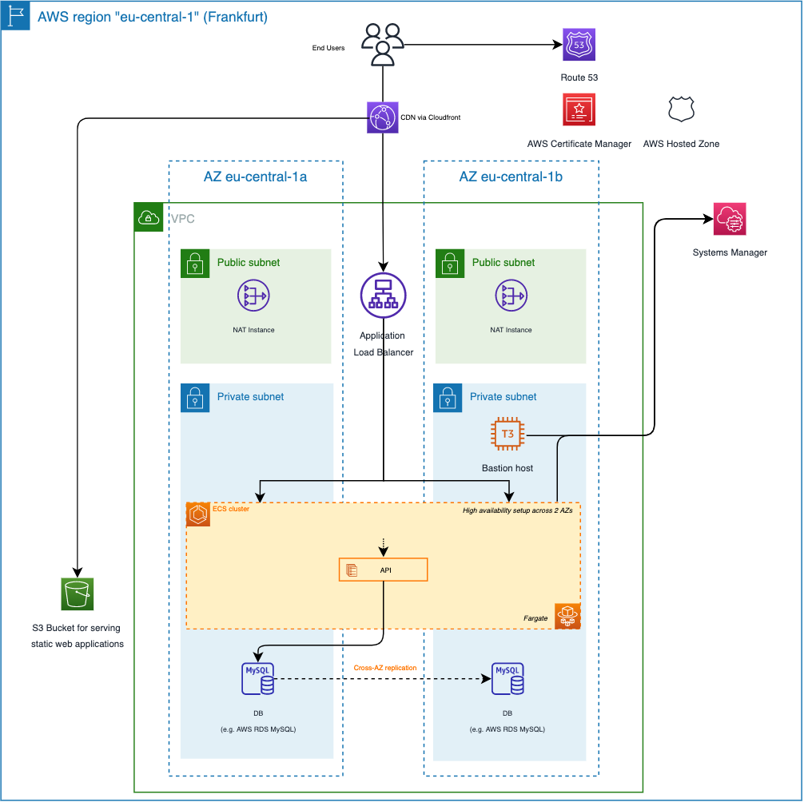

Getting Started
===============

This getting started guide will help you deploy your first environment using Terra3. This guide is split across three steps:

1.  Deploying a static website served from an S3 bucket and AWS Cloudfront

2.  Deploying all from step 1 + an nginx demo container on AWS ECS

3.  Deploying all from step 1 & 2 + providing your own domain name and enabling TLS between Cloudfront and the Application Loadbalancer


Prerequisites
-------------

First, ensure that you have installed the following tools locally.

1.  [aws cli](https://docs.aws.amazon.com/cli/latest/userguide/install-cliv2.html)

2.  [terraform](https://learn.hashicorp.com/tutorials/terraform/install-cli)


### Clone the repo

```
git clone https://github.com/it-objects/terraform-aws-terra3.git
```

Deployment Steps for Example 1
------------------------------

Example 1 will provision a subset of the overall 3-tier architecture, namely

*   the static website served from an S3 bucket and AWS Cloudfront


as depicted in this diagram:


### Terraform INIT

CD into the examples directory:

```
cd terraform-aws-terra3/examples/example_1
```

Initialize the working directory with the following:

```
terraform init
```

### Terraform PLAN

Verify the resources that will be created by this execution:

```
terraform plan
```

### Terraform APPLY

Let’s provision this example.

Note: make sure that the AWS CLI is correctly configured and that you’re deploying to the right AWS account.

```
terraform apply
```

### Validation

After about 30-60 seconds, the script has been applied and a Cloudfront URL is shown similar to this one:

```
cloudfront_default_domain_name = "dcot74k2131h8.cloudfront.net"
```

Use it in your browser to test the static website deployed to S3 and served via Cloudfront.

Please note: it requires another 30 seconds, until the Cloudfront distribution is ready and the website is presented correctly.

It could look something like this when you use the command line tool “curl” to query the URL:

```
❯ curl https://dcot74k2131h8.cloudfront.net  
<h1>Hello world, Terra3!</h1>%  
```

Go to the S3 section in your AWS web console and find the S3 bucket with the index.html file. Feel free, to edit the file and see the change being reflected when reloading the page in your browser.

### Finalization

To clean up your AWS account, issue the following command which will remove all previously provisioned AWS resources.

```
terraform destroy
```

Deployment Steps for Example 2
------------------------------

Example 2 will provision a more advanced subset of the overall 3-tier architecture, namely

*   the static website served from an S3 bucket and AWS Cloudfront and

*   an ECS task with two containers


as depicted in this diagram:


### Terraform INIT

CD into the examples directory:

```
cd terraform-aws-terra3/examples/example_2
```

Initialize the working directory with the following:

```
terraform init
```

### Terraform PLAN

Verify the resources that will be created by this execution:

```
terraform plan
```

### Terraform APPLY

Let’s provision the first example.

Note: make sure that the AWS CLI is correctly configured and that you’re deploying to the right AWS account.

```
terraform apply
```

### Validation

After about 4 minutes, the script has been applied and a Cloudfront URL is shown similar to this one:

```
cloudfront_default_domain_name = "dcot74k2131h8.cloudfront.net"
```

Use it in your browser to test the static website deployed to S3 and served via Cloudfront. Append “/api/” to the end of the URL to check that traffic is routed correctly to your nginxdemos/hello container via the application load balancer.

Please note: it requires another 30 seconds, until the Cloudfront distribution and the containers are ready and the website is presented correctly.

It could look something like this when you use the command line tool “curl” to query the URL:

```
❯ curl https://dcot74k2131h8.cloudfront.net  
<h1>Hello world, Terra3!</h1>%  

❯ curl https://dcot74k2131h8.cloudfront.net/api/  
<!DOCTYPE html>
<html>
<head>
<title>Hello World</title>
...
```

Go to the ECS section in your AWS web console and find the ECS cluster. You should be able to see the task with two containers you just have deployed. The

### Finalization

To clean up your AWS account, issue the following command which will remove all previously provisioned AWS resources.

```
terraform destroy
```

Deployment Steps for Example 3
------------------------------

Example 3 will provision an even more advanced subset of the overall 3-tier architecture, namely

*   the static website served from an S3 bucket and AWS Cloudfront and

*   an ECS task with two containers and

*   your own domain + ACM certificates


as depicted in this diagram:



A subdomain will be created named after the name of your solution (solution\_name parameter). Also a second subdomain will be created for your loadbalancer so that we also achieve a transport encryption with TLS between Cloudfront and the Application Loadbalancer.

**Please note: there’s a prerequisite to this example. A Route53 Hosted Zone needs to be provisioned into your account already, with a domain attached to it. The ID of the hosted zone is required as input parameter, so that the Terraform script can be executed.**

### Terraform INIT

CD into the examples directory:

```
cd terraform-aws-terra3/examples/example_3
```

Initialize the working directory with the following:

```
terraform init
```

### Update Route53 Hosted Zone Id

As mentioned in the prerequisite to this example, please open the [main.tf](http://main.tf) file and enter the Route53 hosted zone ID.

```
locals {
  route53_zone_id = "<PLEASE ENTER HERE THE HOSTED ZONE ID>"  
  solution_name   = "terra3-example3"
}
```

### Terraform PLAN

Verify the resources that will be created by this execution:

```
terraform plan
```

### Terraform APPLY

Let’s provision the first example.

Note: make sure that the AWS CLI is correctly configured and that you’re deploying to the right AWS account.

```
terraform apply
```

### Validation

After about 6 minutes, the script has been applied and a Cloudfront URL is shown similar to this one:

```
cloudfront_default_domain_name = "dcot74k2131h8.cloudfront.net"
```
Please note: it requires another 30 seconds, until the Cloudfront distribution is ready and the website is presented correctly.

Use it in your browser to test the static website deployed to S3 and served via Cloudfront. If you have setup a hosted
zone correctly with your domain, you should now also be able to use your domain name in your browser following this schema:

```
<solution_name>.<domain_name given in your hosted zone>, e.g.
terra3-example3.terra3.io where "terra3-example3" is the solution_name and terra3.io the hosted zone domain name.
```

It could look something like this when you use the command line tool “curl” to query the URL:

```
❯ curl https://terra3-example3.terra3.io       # use your domain name here, as this example won't work  
<h1>Hello world, Terra3!</h1>%  

❯ curl https://terra3-example3.terra3.io/api/  # use your domain name here, as this example won't work  
<!DOCTYPE html>
<html>
<head>
<title>Hello World</title>
...
```

Go to the ECS section in your AWS web console and find the ECS cluster. You should be able to see the task with two containers you just have deployed. The

Go to the EC2 section, select the bastion host from the list and click on "Connect". Select the "Session Manager" tab and click connect. Now, you should be able to shell into the EC2 instance in the most secure way. After installing the mysql client, you should also be able to access the RDS MySQL database, as security groups are configured accordingly.

### Finalization

To clean up your AWS account, issue the following command which will remove all previously provisioned AWS resources.

```
terraform destroy
```
